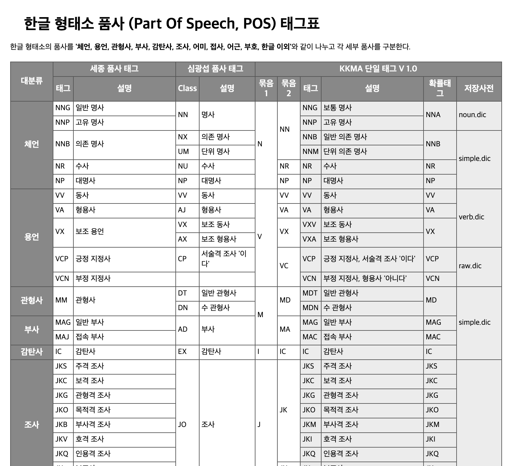

# morph
음절과 어절(한국어 처리에 한정한 논의임)          

## 음절          
하나의 종합된 음의 느낌을 주는 말소리의 단위. 몇 개의 음소로 이루어지며, 모음은 단독으로 한 음절이 되기도 한다. ‘아침’의 ‘아’와 ‘침’ 따위이다.(출처: 우리말샘)       

(예) 아/버/지/가/방/에/들/어/가/신/다         

## 어절          
문장을 구성하고 있는 각각의 마디. 문장 성분의 최소 단위로서 띄어쓰기의 단위가 된다.     

(예) 아버지가/방에/들어가신다   

## 형태소  
자립성 여부에 따라 분류           

(예) 아버지/가/방/에/들어가/시/ㄴ다           

형태소 분류 기준에 대해서는 다음 이미지 출처 참조         
http://kkma.snu.ac.kr/documents/?doc=postag  

    

어절단위 형태소 분석에서 난제      
대부분의 형태소 분석기들이 감탄사의 목록을 너무 협소하게 잡고 있음        
현재 우리말샘(사전)에 등재되어 있는 감탄사는 1,929개임          

<비등재 감탄사 중에 등재가 필요해 보이는 목록>   
ㅋ, ㅋㅋ        
ㅠ, ㅠㅠ             

          

<우리말샘에 바라는 것>      
그죠 그쵸 그치 그렇지 그르치 그렇지가 유의관계로 형성되어 있으면 함         

-그렇죠는 여기서 논의할 수 없음         

==================================================

우리말샘 링크        

https://opendict.korean.go.kr/main

우리말샘에 대한 정보는 다음 깃헙 레포를 참고할 것           
 
https://github.com/songys/Dictionaries

